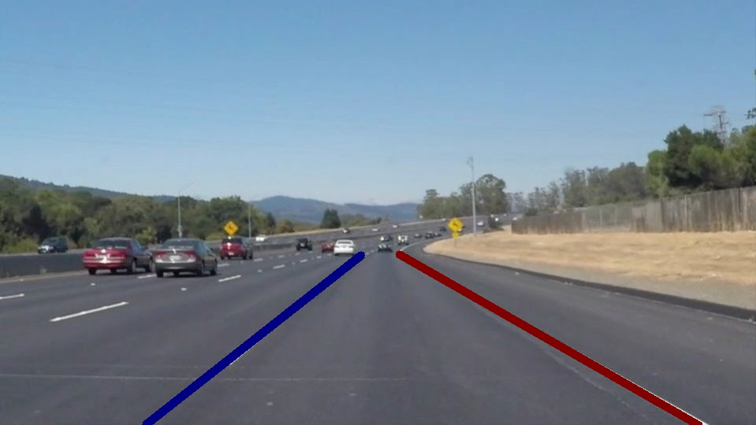

# Finding Lane Lines on the Road

### 1. Describe your pipeline. As part of the description, explain how you modified the draw_lines() function.

The pipeline (`detect_lanes` function) performs the following steps:

1. convert the image to grayscale
2. Canny edge detection on the whole image
3. select a trapezium-shaped ROI depicted in Fig. 1. (`create_mask`)
4. find lines with the provided Hough transform based method
5. get the parameters (`a,b,c`) of the lines from their equations `a*x + b*y + c = 0` (`line_to_normal_eq`)
6. define three reference lines: the two diagonals of the image (these should serve as reference lane borders) and a 'trap' line along the bottom of the image (`filter_lines`)
7. calculate the 'distance' of the reference lines and the lines found by the Hough transform (`normal_line_pair_distances`), line 'distance' is detailed below
8. form three class of lines by selecting the closest reference line: lefts, rights and trapped, trapped group is discarded (`filter_lines`)
9. select/calculate exactly one line from every group (lefts, rights) (`select_one_line`)

Fig. 1.

At the end of this pipeline, we have a pair of lines. These are the left and right lane borders the method selected.

The 'distance' of line A and line B with parameters `a1, b1, c1` and `a2, b2, c2`:

`1 - abs(dot(normalize(a1, b1), normalize(a2, b2))) + abs(c1 - c2) / m`

where `m` is the diagonal length of the image (the maximum the line parameter `c` can take in this image). Note that `(a1,b1)` and `(a2,b2)` are the normal vectors of line A and B. We take their normalized versions and get a score for the proximity of their directions. The last term of the 'distance' is roughly the absolute distance of the line offset parameters. Note that both terms are in the range of [0, 1], so there is no precedence for the 'direction proximity' or for the 'offset proximity'.

After getting the left and right line parameters we need to draw them on the image. We define two parallel lines across the image, one is the horizontal line through the center and the other is the horizontal line along the bottom of the image. Then, given a line, we can get the intersecting points with the two defined lines (`line_to_normal_eq`). Both the left and the right lines are cut by the defined lines and the point coordinates can be used to draw the lines with the provided function `draw_lines`.

Some explanation for `line_to_normal_eq`: we are given the paramters `x1,y1,x2,y2` for a line. We would like to have `a,b,c` parameters of the line equation `a*x+b*y+c=0`. Note that the latter equation can be written as `dot((a,b,c),(x,y,1))=0`. As `(x1,y1)` and `(x2,y2)` are on the line `dot((a,b,c),(x1,y1,1))=0` and `dot((a,b,c),(x2,y2,1))=0` holds. Which means that the vector `(a,b,c)` is perpendicular both to the vectors `(x1,y1,1)` and `(x2,y2,1)`. Hence, a solution for `(a,b,c)` is the cross product of `(x1,y1,1)` and `(x2,y2,1)`.

Some explanation for `normal_eq_intersect`: we have two lines `(a1,b1,c1)` and `(a2,b2,c2)`. We aim to find the vector `(x,y,1)` that satisfies `[(a1,b1,c1), (a1,b1,c1)]*(x,y,1)=0` where `[(a1,b1,c1), (a1,b1,c1)]` is a 2x3 matrix and `*` is a matrix multiplication. Solving this homogeneous linear equation will give the intersection point `(x,y)`.

A sample from the results:

Fig. 2.

### 2. Identify potential shortcomings with your current pipeline

The parameters for the Hough transformation are set so it gives good results for the test images. It can be potentially insufficient for other images taken under different lighting conditions. If there is no line found by the Hough transformation nothing will be drawn on the image.

Also, a high curvature of the lane border lines will potentially end up in a poor result when running this algorithm.

### 3. Suggest possible improvements to your pipeline

A possible improvement could be utilizing the results of the previous frame. Subsequent frames do not differ very much from each other so the found lines should not too.